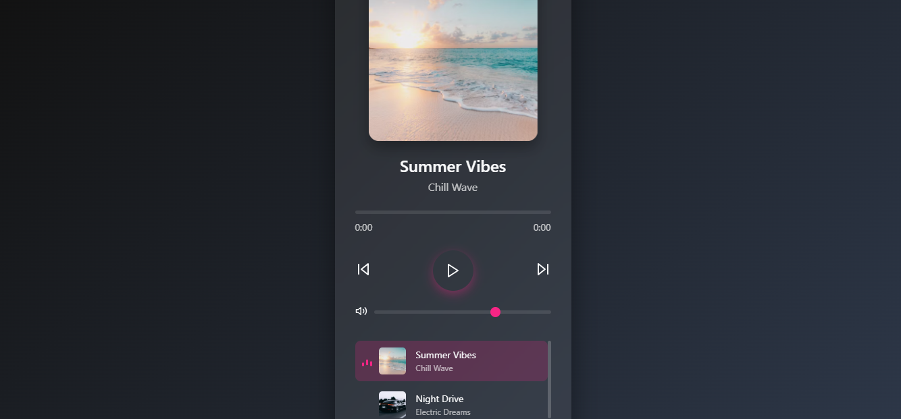

# 🎵 Music Player using JavaScript

A simple and interactive music player built using HTML, CSS, and JavaScript. This project demonstrates the use of front-end technologies to create a fully functional music player UI.

## 🧱 Architecture Overview

This project follows a three-layered architecture:

### 1. **HTML (Structure)**
- Provides the layout and structure of the music player.
- Includes elements like play/pause buttons, audio tag, and song information display.

### 2. **CSS (Styling)**
- Adds styling to all HTML elements.
- Responsible for the visual layout, responsiveness, and animations.

### 3. **JavaScript (Functionality)**
- Adds interactive behavior to the HTML elements.
- Handles:
  - Play/Pause toggle
  - Switching songs
  - Updating song metadata
  - Syncing UI with playback events

## 💡 Features

- Play/Pause functionality
- Next/Previous track switching
- Dynamic music info display
- Responsive design

## 📁 Files Included

- `index.html` — Structure of the player
- `style.css` — Styling for the layout and UI
- `script.js` — Logic and functionality
- `output.png` — Screenshot of the final UI

## 🚀 How to Run

1. Clone or download the repository.
2. Open `index.html` in your browser.
3. Interact with the music player.

## 📌 Technologies Used

- HTML5
- CSS3
- JavaScript (ES6)

---

Feel free to customize this music player with your own songs and styles!
